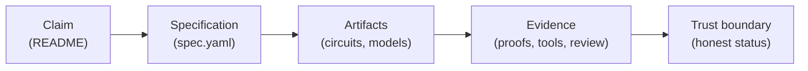

<div align="center">

<pre>
###########################################################
  ____   _____                 ____                  _     
 / __ \ / ____|               |  _ \                | |    
| |  | | (___  _ __   ___  ___| |_) | ___ _ __   ___| |__  
| |  | |\___ \| '_ \ / _ \/ __|  _ < / _ \ '_ \ / __| '_ \ 
| |__| |____) | |_) |  __/ (__| |_) |  __/ | | | (__| | | |
 \___\_\_____/| .__/ \___|\___|____/ \___|_| |_|\___|_| |_|
              | |                                          
              |_|                                          
###########################################################
</pre>

**A shared benchmark suite for checking quantum correctness claims — with honest evidence.**

[](https://github.com/fraware/QSpecBench/actions/workflows/validate.yml)
[](LICENSE)
[](https://www.python.org/downloads/)
[](docs/status.md)

[Quick start](#quick-start) · [Contribute](#contribute) · [Tracks](#tracks) · [Dashboard](docs/status.md) · [Docs](#documentation)

</div>

---

## The problem

Quantum software makes bold promises: *this circuit is equivalent to that one*, *this error-correcting code fixes single-bit flips*, *this simulation step is accurate within a bound*. Tools and papers evaluate these claims in incompatible ways — mixing up the statement, the input files, the checker output, and what was actually proved.

**QSpecBench gives everyone the same vocabulary.** Each benchmark is a small, reviewable package: what you claim, what would count as success, the files to check, and what evidence exists today — including what is still assumed or unverified.

---

## What you get in every benchmark

| Piece | What it is | Where it lives |
|-------|------------|----------------|
| **Claim** | Plain-language statement of what should be true | `README.md` |
| **Specification** | Machine-readable contract (preconditions, postconditions, bounds) | `spec.yaml` |
| **Artifacts** | Circuits, Hamiltonians, code tables, source text | `artifacts/` |
| **Evidence** | Checker output, proofs, simulations, review notes | `evidence/` + `notes/` |
| **Trust boundary** | What is proved, what is trusted, what is still open | `README.md` + `spec.yaml` |

Nothing is labeled "verified" unless a declared checker passed and the trust boundary says so.



---

## Tracks

Pick the area that matches your expertise. Each track has seed examples you can copy and adapt.

| Track | Focus | Examples |
|-------|-------|----------|
| [**Algorithms**](benchmarks/algorithms/) | Protocols and quantum algorithms | Teleportation, Grover, phase estimation |
| [**Equivalence**](benchmarks/equivalence/) | Circuit and compiler transformations | Gate cancellation, QFT identity, Clifford simplification |
| [**QEC**](benchmarks/qec/) | Error correction and fault tolerance | Bit-flip code, stabilizer codes, surface code |
| [**Hamiltonian**](benchmarks/hamiltonian/) | Simulation, mappings, resource bounds | Hermiticity, Trotter steps, Jordan–Wigner |
| [**AI formalization**](benchmarks/ai_formalization/) | Turning informal claims into formal specs | Rubric-scored formalization tasks |

Browse the full list in the [live dashboard](docs/status.md).

---

## How evidence is labeled

We separate *what you checked* from *what you hope to check later*. Common evidence types:

| Type | Meaning |
|------|---------|
| **Proof assistant** | Theorem checked by the Lean 4 kernel (CI runs `lake build`) |
| **Equivalence checker** | Circuits compared with tools such as QCEC |
| **Solver certificate** | SAT/SMT output verified by a certificate checker |
| **Simulation** | Numerical or stochastic check — supportive, not a proof |
| **Human review** | Expert review of derivations or rubrics |
| **AI draft** | Model-generated content — always untrusted until independently checked |

Simulation and LLM output can inform a benchmark; they do not by themselves make a claim proved.

---

## Quick start

**Prerequisites:** Python 3.10+, [pip](https://pip.pypa.io/). Lean 4 is optional locally; CI installs it via [elan](https://github.com/leanprover/elan) when running proofs.

```bash
git clone https://github.com/fraware/QSpecBench.git
cd QSpecBench

# Install the CLI and dev tools
pip install -e ".[dev]"

# Validate every benchmark against the schema
qspecbench validate benchmarks/

# Inspect one benchmark end-to-end
qspecbench check-evidence benchmarks/equivalence/cnot_self_inverse_cancellation/

# Summary table of maturity and evidence
qspecbench status benchmarks/
qspecbench dashboard benchmarks/ --out docs/status.md

# Run the test suite
pytest
```

**Lean proofs** (optional, for contributors adding machine-checked theorems):

```bash
cd lean && lake build
```

---

## Contribute

We welcome benchmarks, better evidence, documentation fixes, and new checker adapters. You do not need a finished proof to open a pull request — a clear claim with honest status is a valuable contribution.

### Your first benchmark

1. Read [Adding a benchmark](docs/adding_a_benchmark.md) and [CONTRIBUTING.md](CONTRIBUTING.md).
2. Copy [`benchmarks/_template/`](benchmarks/_template/) into the right track folder.
3. Use a nearby **reference scaffold** as a style guide (each demonstrates the format; none yet proves its full headline claim):
   - Algorithms → [`teleportation_preserves_state_up_to_pauli_correction`](benchmarks/algorithms/teleportation_preserves_state_up_to_pauli_correction/)
   - Equivalence → [`cnot_self_inverse_cancellation`](benchmarks/equivalence/cnot_self_inverse_cancellation/)
   - QEC → [`three_qubit_bit_flip_code_corrects_one_x`](benchmarks/qec/three_qubit_bit_flip_code_corrects_one_x/)
   - Hamiltonian → [`small_fermionic_hamiltonian_is_hermitian`](benchmarks/hamiltonian/small_fermionic_hamiltonian_is_hermitian/)
   - AI formalization → [`formalize_no_cloning_statement`](benchmarks/ai_formalization/formalize_no_cloning_statement/)
4. Validate locally: `qspecbench validate benchmarks/<track>/<your_id>/`
5. Open a PR with the benchmark issue template.

### Maturity levels

Maturity is **scoped**: it separates "this benchmark has some checked evidence" from "the full
informal headline claim is proved".

| Level | What we expect |
|-------|----------------|
| **seed** | Claim, spec, and trust boundary — proof optional |
| **usable** | Complete card, runnable artifacts, evidence path, CI green |
| **reference_scaffold** | Passing CI plus at least one checked-evidence obligation, but the headline claim is only partially checked. Demonstrates the evidence format and trust-boundary discipline. |
| **reference_contract** | Like `reference_scaffold`, for benchmarks whose checked evidence is a declared contract (e.g. a resource or error-bound contract) rather than a proof of the bound itself. |
| **reference_artifact** | Like `reference_scaffold`, where the checked evidence is artifact-structural (e.g. stabilizer commutation) rather than a proof of the headline claim. |
| **reference_claim** | The headline claim is fully proved: every required obligation passes, all required evidence exists and passes, and `headline_claim_status` is `checked`. |
| **deprecated** | Retained for history; README explains why. |

Most current entries are **reference scaffolds**: they demonstrate the QSpecBench evidence format and
trust-boundary discipline, but they do not yet prove the full informal headline claim. A benchmark is
only `reference_claim` when its `claim_scope` / `proved_scope` obligations are all checked.

Promotion is documented in [reference benchmarks](docs/reference_benchmarks.md) and reviewed per
[GOVERNANCE.md](GOVERNANCE.md).

### Other ways to help

- Improve an existing benchmark's evidence or documentation
- Add or extend [adapters](adapters/) for new checkers
- Extend the Lean library under [`lean/QSpecBench/`](lean/QSpecBench/)
- Fix issues labeled `good first issue`

Be precise about verification claims: say what was checked and with which tool.

---

## Versions

QSpecBench versions the schema, the tooling, and the benchmark corpus separately so that a change in
one does not imply maturity in the others. See [versioning](docs/versioning.md).

| Component | Version |
|---|---|
| **Schema** (`qspecbench_version`) | 0.2 |
| **Tooling** (`qspecbench` CLI / Lean lib) | 0.2.0 |
| **Corpus** (benchmark suite) | 0.2.0 |
| **Release tag** | v0.2.1 |

**Release honesty (v0.2.1):** tag `v0.2.1` (`278119a`) delivers incremental bridge metadata, measurement
semantics stubs, and governance docs on the v0.2 schema. CI run
[28395530818](https://github.com/QSpecBench/QSpecBench/actions/runs/28395530818) validated the release gate.
Most benchmarks remain **reference scaffolds**; only `reference_claim` entries assert a checked headline.
See [versioning.md](docs/versioning.md) for honest scope.

<!-- qspecbench-status-begin -->
Honest status: most entries are **reference scaffolds** demonstrating the evidence format. **9**
benchmarks are `reference_claim` under declared internal scope (see `headline_claim_status.checked_under`).

| | |
|---|---|
| **Benchmarks** | 48 across 5 tracks |
| **Reference scaffolds** (any scoped reference level) | 40 |
| **With headline claim checked** (`reference_claim`) | 9 |
| **With any checked evidence** | 44 |
| **Manifest-checked theorem bindings** | 6 |
| **Python denotation consistency checks** | 2 |
| **Kernel-checked codegen-trace bridges** | 6 |
| **Coq/Rocq/Isabelle (optional CI)** | excluded from default maturity counts |
| **CI** | Schema validation, evidence checks, Lean proofs, verify-bridge, circuit equivalence (QCEC) |

Details and per-benchmark breakdown: **[dashboard](docs/status.md)** (regenerate with `qspecbench dashboard benchmarks/ --out docs/status.md`).
<!-- qspecbench-status-end -->

---

## Documentation

| Topic | Guide |
|-------|-------|
| Core concepts | [Claim model](docs/claim_model.md) |
| `spec.yaml` fields | [Schema reference](docs/schema_reference.md) |
| Evidence types and checkers | [Evidence model](docs/evidence_model.md) |
| What is proved vs assumed | [Trust boundaries](docs/trust_boundaries.md) |
| Lean setup | [Lean setup](docs/lean_setup.md) |
| Schema v0.2 migration | [Migration guide](docs/schema_migration_0.2.md) |

---

## License

[MIT](LICENSE) — use, modify, and contribute freely.
