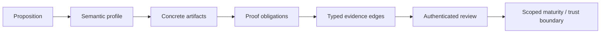

<div align="center">

<pre>
###########################################################
  ____   _____                 ____                  _     
 / __ \ / ____|               |  _ \                | |    
| |  | | (___  _ __   ___  ___| |_) | ___ _ __   ___| |__  
| |  | |\___ \| '_ \ / _ \/ __|  _ < / _ \ '_ \ / __| '_ \ 
| |__| |____) | |_) |  __/ (__| |_) |  __/ | | | (__| | | |
 \___\_\_____/| .__/ \___|\___|____/ \___|_| |_|\___|_| |_|
              | |                                          
              |_|                                          
###########################################################
</pre>

**A shared benchmark suite for checking quantum correctness claims — with honest evidence.**

[](https://github.com/fraware/QSpecBench/actions/workflows/validate.yml)
[](https://github.com/fraware/QSpecBench/actions/workflows/lint.yml)
[](LICENSE)
[](https://www.python.org/downloads/)
[](docs/status.md)

[Quick start](#quick-start) · [Contribute](#contribute) · [Tracks](#tracks) · [Dashboard](docs/status.md) · [Docs](#documentation)

</div>

---

## The problem

Quantum software makes bold promises: *this circuit is equivalent to that one*, *this error-correcting code fixes single-bit flips*, *this simulation step is accurate within a bound*. Tools and papers evaluate these claims in incompatible ways — mixing up the statement, the input files, the checker output, and what was actually proved.

**QSpecBench gives everyone the same vocabulary.** Each benchmark is a small, reviewable package: what you claim, what would count as success, the files to check, and what evidence exists today — including what is still assumed or unverified.

The long-term architecture is an assurance graph: proposition → semantic profile → concrete artifacts → proof obligations → typed evidence edges → authenticated review → scoped maturity. The schema-0.3 corpus is migrating toward that architecture; see [full-vision execution gates](docs/full_vision_execution.md).

---

## What you get in every benchmark

| Piece | What it is | Where it lives |
|-------|------------|----------------|
| **Claim** | Plain-language statement of what should be true | `README.md` |
| **Specification** | Machine-readable contract (preconditions, postconditions, bounds) | `spec.yaml` |
| **Artifacts** | Circuits, Hamiltonians, code tables, source text | `artifacts/` |
| **Evidence** | Checker output, proofs, simulations, review notes | `evidence/` + `notes/` |
| **Trust boundary** | What is proved, what is trusted, what is still open | `README.md` + `spec.yaml` |
| **Assurance graph** | Migration sidecar binding proposition, semantics, obligations and evidence edges | `assurance_graph.yaml` when migrated |

Nothing is labeled "verified" merely because a tool ran. The exact proposition, semantic assumptions, evidence scope, and residual trust boundary matter.


```mermaid
flowchart LR
  C["Proposition"] --> S["Semantic profile"]
  S --> A["Concrete artifacts"]
  A --> O["Proof obligations"]
  O --> E["Typed evidence edges"]
  E --> R["Authenticated review"]
  R --> T["Scoped maturity / trust boundary"]
```

---

## Tracks

Pick the area that matches your expertise. Each track has seed examples you can copy and adapt.

| Track | Focus | Examples |
|-------|-------|----------|
| [**Algorithms**](benchmarks/algorithms/) | Protocols and quantum algorithms | Teleportation, Grover, phase estimation |
| [**Equivalence**](benchmarks/equivalence/) | Circuit and compiler transformations | Gate cancellation, QFT identity, Clifford simplification |
| [**QEC**](benchmarks/qec/) | Error correction and fault tolerance | Bit-flip code, stabilizer codes, surface code |
| [**Hamiltonian**](benchmarks/hamiltonian/) | Simulation, mappings, resource bounds | Hermiticity, Trotter steps, Jordan–Wigner |
| [**AI formalization**](benchmarks/ai_formalization/) | Turning informal claims into formal specs | Rubric-scored formalization tasks |

Browse the full list in the [live dashboard](docs/status.md).

---

## How evidence is labeled

We separate *what you checked* from *what you hope to check later*. Common evidence types:

| Type | Meaning |
|------|---------|
| **Proof assistant** | Theorem checked by the Lean 4 kernel (CI runs `lake build`) |
| **Equivalence checker** | Circuits compared with tools such as QCEC; external-tool trust remains explicit |
| **Solver certificate** | SAT/SMT output verified by a certificate checker |
| **Simulation** | Numerical or stochastic check over a declared regime — supportive, not a universal proof |
| **Human review** | Expert judgment; promotion target requires authenticated reviewer identity and exact artifact/commit binding |
| **AI draft** | Model-generated content — always untrusted until independently checked |

Simulation and LLM output can inform a benchmark; they do not by themselves make a claim proved. A kernel-checked theorem proves the formal theorem under its assumptions; it does not by itself establish that the theorem is semantically equivalent to the intended source claim.

---

## Quick start

**Prerequisites:** Python 3.10+, [pip](https://pip.pypa.io/). Lean 4 is optional locally; CI installs it via [elan](https://github.com/leanprover/elan) when running proofs.

```bash
git clone https://github.com/fraware/QSpecBench.git
cd QSpecBench

# Install the CLI and dev tools
pip install -e ".[dev]"

# Validate every benchmark against the schema
qspecbench validate benchmarks/

# Inspect one benchmark end-to-end
qspecbench check-evidence benchmarks/equivalence/cnot_self_inverse_cancellation/

# Summary table of maturity and evidence
qspecbench status benchmarks/
qspecbench dashboard benchmarks/ --out docs/status.md

# Run the test suite
pytest
```

**Lean proofs** (optional, for contributors adding machine-checked theorems):

```bash
cd lean && lake build
```

---

## Contribute

We welcome benchmarks, better evidence, documentation fixes, and new checker adapters. You do not need a finished proof to open a pull request — a clear claim with honest status is a valuable contribution.

### Your first benchmark

1. Read [Adding a benchmark](docs/adding_a_benchmark.md) and [CONTRIBUTING.md](CONTRIBUTING.md).
2. Copy [`benchmarks/_template/`](benchmarks/_template/) into the right track folder.
3. Use a nearby benchmark as a structural style guide, but copy its maturity/evidence claims only when your own obligations genuinely satisfy them. Current examples span multiple maturity levels:
   - Algorithms → [`teleportation_preserves_state_up_to_pauli_correction`](benchmarks/algorithms/teleportation_preserves_state_up_to_pauli_correction/)
   - Equivalence → [`cnot_self_inverse_cancellation`](benchmarks/equivalence/cnot_self_inverse_cancellation/)
   - QEC → [`three_qubit_bit_flip_code_corrects_one_x`](benchmarks/qec/three_qubit_bit_flip_code_corrects_one_x/)
   - Hamiltonian → [`small_fermionic_hamiltonian_is_hermitian`](benchmarks/hamiltonian/small_fermionic_hamiltonian_is_hermitian/)
   - AI formalization → [`formalize_no_cloning_statement`](benchmarks/ai_formalization/formalize_no_cloning_statement/)
4. Validate locally: `qspecbench validate benchmarks/<track>/<your_id>/`
5. Open a PR with the benchmark issue template.

### Maturity levels

Maturity is **scoped**: it separates "this benchmark has some checked evidence" from "the full declared headline claim is checked under its stated semantics and trust boundary".

| Level | What we expect |
|-------|----------------|
| **seed** | Claim, spec, and trust boundary — proof optional |
| **usable** | Complete card, runnable artifacts, evidence path; observed CI state is separate from authored metadata |
| **reference_scaffold** | At least one meaningful checked-evidence obligation, but the headline claim is only partially checked |
| **reference_contract** | Checked evidence is a declared contract (e.g. resource/error contract), not a proof of a stronger bound |
| **reference_artifact** | Checked evidence is artifact-structural rather than proof of the headline claim |
| **reference_claim** | Full declared headline scope is closed by required evidence under its stated semantics and review requirements |
| **artifact_bound_reference_claim** | `reference_claim`-level scope with explicit binding from the checked proposition/semantics to concrete artifact identity; schema-0.4 migration additionally targets total assurance-graph closure |
| **deprecated** | Retained for history; README explains why |

Promotion is documented in [reference benchmarks](docs/reference_benchmarks.md), [GOVERNANCE.md](GOVERNANCE.md), and the corrected [definition of completion](docs/definition_of_completion.md). During the full-vision migration, new high-maturity promotions should not bypass issues #12–#15 (authenticated review, total evidence closure, semantic profiles, typed adapters).

### Other ways to help

- Improve an existing benchmark's evidence or documentation
- Add or extend [adapters](adapters/) for new checkers
- Extend the Lean library under [`lean/QSpecBench/`](lean/QSpecBench/)
- Fix open trust/scientific issues

Be precise about verification claims: say what proposition was checked, under which semantics, with which artifact and tool, and what remains assumed.

---

## Versions

QSpecBench versions the schema, the tooling, and the benchmark corpus separately so that a change in one does not imply maturity in the others. See [versioning](docs/versioning.md).

| Component | Version |
|---|---|
| **Schema** (`qspecbench_version`) | 0.3 |
| **Tooling** (`qspecbench` CLI / Lean lib) | 0.2.0 |
| **Corpus** (benchmark suite) | 0.2.0 |
| **Release tag** | v0.2.3 |

**Release honesty:** tag `v0.2.3` is historical and predates the current working tree. The current corpus has expanded ABRC/RC coverage (see [generated status](docs/generated_status.md) and [dashboard](docs/status.md)). Historical dual hash-bound review artifacts are retained as recorded evidence; they must not be described as authenticated independent reviewer identity until migrated to review-attestation v2 under issue #12. A current branch/head is not called release-reproduced until exact-head CI and bundle verification are observed.

### Permanent residuals (not a complete FV standard)

QSpecBench remains a **scoped research benchmark and assurance infrastructure**, not a complete quantum formal-verification standard. Permanent trust boundaries include:

| Item | Disposition |
|------|-------------|
| `unbounded_all_codes_mwpm` | `not_applicable`; finite evidence cannot certify an open-ended all-code family |
| Device `hardware_semantics` / `device_fidelity` / `pulse_schedule_semantics` | Stay `not_checked`; ISA-layer checks are separate |
| Unnormalized `denotateOps3C` Toffoli equality | Out of scope for the normalized Clifford+T decomposition proposition |
| QBricks / ZX | Adapters exist; trust remains tied to the actual executed evidence/certificate |
| Rocq / Isabelle skip stubs | Never counted as checked evidence |
| Full industrial Stim/Blossom all-codes | Outside the declared finite evidence universe |

Details: [research_tracks.md](docs/research_tracks.md), [definition_of_completion.md](docs/definition_of_completion.md).

<!-- qspecbench-status-begin -->
Audited corpus snapshot (Aug. 24, 2026; generated source of truth: [docs/generated_status.md](docs/generated_status.md)):

| | |
|---|---|
| **Benchmarks** | 50 across 5 tracks |
| **`reference_claim`** | 9 |
| **`artifact_bound_reference_claim`** | 10 |
| **With headline claim checked under declared scope** | 19 |
| **With any checked evidence** | 46 |
| **QEC small-code certificate level** | 12 |
| **QEC external-certificate level** | 1 |

These are descriptive corpus counts, not evidence that community-grade governance or the full scientific reference suite is complete. Exact current CI state must be read from the workflow run for the exact commit, not from authored `status.ci` fields.

Details and per-benchmark breakdown: **[dashboard](docs/status.md)**.
<!-- qspecbench-status-end -->

---

## Documentation

| Topic | Guide |
|-------|-------|
| Core concepts | [Claim model](docs/claim_model.md) |
| Full-vision architecture and exit gates | [Full-vision execution](docs/full_vision_execution.md) |
| Typed adapter protocol | [Adapter protocol](docs/adapter_protocol.md) |
| Authenticated review | [Review attestations](docs/review_attestations.md) |
| Interoperability/version isolation | [Interoperability matrix](docs/interoperability_matrix.md) |
| v1 release contract | [v1 release criteria](docs/release_v1_criteria.md) |
| `spec.yaml` fields | [Schema reference](docs/schema_reference.md) |
| Evidence types and checkers | [Evidence model](docs/evidence_model.md) |
| What is proved vs assumed | [Trust boundaries](docs/trust_boundaries.md) |
| Completion levels | [Definition of completion](docs/definition_of_completion.md) |
| Scientific targets / residuals | [Research tracks](docs/research_tracks.md) |
| Lean setup | [Lean setup](docs/lean_setup.md) |
| Schema v0.3 migration | [Migration guide](docs/schema_migration_0.3.md) |

---

## License

[MIT](LICENSE) — use, modify, and contribute freely.
