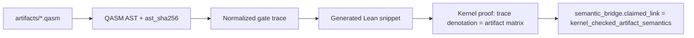

# OpenQASM-to-Lean bridge codegen design (deferred)

Full **kernel-checked artifact semantics** (`kernel_checked_artifact_semantics`) requires Lean proofs
that the OpenQASM artifact denotes the same operator as the formal gate semantics — not merely a
manifest-listed theorem on a fixed gate trace.

## Current state

- **manifest_checked_theorem_binding**: allowlisted gate trace + Lean theorem name + SHA256 hashes
- **python_denotation_consistency**: Python matrix extractor matches Lean `denotateOps*` on trace
- **RX blocker**: `ComplexGate.rxGate` exists, but `OpenQASM3` still uses H-plumbing for RX traces

## Target architecture

## Planned steps

1. **AST canonicalization** — stable JSON AST, `ast_sha256` in `bridge_theorem_manifest.json`
2. **Codegen** — emit Lean `def <benchmark>_ops` from trace (parameterized gates: RX(θ), RZ(θ), U)
3. **Proof templates** — `denotateOpsN <benchmark>_ops = <matrix>` by `fin_cases` or tactic macro
4. **Hash pipeline** — `generated_lean_sha256`, CI drift check vs manifest
5. **Obligation wiring** — `obligation_ids` in manifest maps theorems to `claim_scope` entries
6. **First candidate** — `cnot_self_inverse_cancellation` (already proved manually) retrofitted as codegen golden test
7. **Second candidate** — parameterized RX(π/2) using `ComplexGate.rxGate`, replacing H scaffold

## Out of scope for first kernel bridge

- Dynamic circuits (measurement, classical control)
- Full OpenQASM3 language
- Hardware calibration semantics

## CI implications

- New job: `bridge-codegen verify` comparing manifest hashes to generated Lean
- Keeps separate from manifest binding job to avoid conflating trust levels

See [roadmap.md](roadmap.md) P1/P2 milestones.
