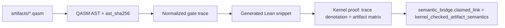

# OpenQASM-to-Lean bridge codegen design

Full **kernel_checked_artifact_semantics** (`kernel_checked_artifact_semantics`) requires Lean proofs
that the OpenQASM artifact denotes the same operator as the formal gate semantics — not merely a
manifest-listed theorem on a fixed gate trace.

## Current state (2026-06-27)

- **manifest_checked_theorem_binding**: allowlisted gate trace + Lean theorem name + SHA256 hashes
- **python_denotation_consistency**: Python matrix extractor matches Lean `denotateOps*` on trace
- **Codegen pilot (cnot_self_inverse_cancellation)**: canonical AST + `ast_sha256` +
  `generated_lean_sha256` wired in `bridge_theorem_manifest.json`; generated Lean stub at
  `evidence/cnot_self_inverse_cancellation_codegen_ops.lean`. `claimed_link` remains
  `manifest_checked_theorem_binding` — **not** upgraded to `kernel_checked_artifact_semantics`.
- **Codegen expansion**: `hadamard_conjugates_x_to_z` and `single_qubit_gate_cancellation` now
  have AST + generated Lean hashes and CI `bridge-codegen verify`.
- **RX(π/2)**: `QasmOp.rx` + `ComplexGate.rxGate` wired; `bridge_rx_pi2_denotation` proves
  complex rotation; int scaffold uses `bridge_rx_pi2_int_eq_h`. Manifest promotion blocked;
  `rx_gate_equivalence_small_instance` stays `reference_scaffold`.

## Target architecture

## Planned steps

1. **AST canonicalization** — stable JSON AST, `ast_sha256` in `bridge_theorem_manifest.json` (pilot done for CNOT)
2. **Codegen** — emit Lean `def <benchmark>_ops` from trace (parameterized gates: RX(θ), RZ(θ), U)
3. **Proof templates** — `denotateOpsN <benchmark>_ops = <matrix>` by `fin_cases` or tactic macro
4. **Hash pipeline** — `generated_lean_sha256`, CI drift check via `qspecbench bridge-codegen verify`
5. **Obligation wiring** — `obligation_ids` in manifest maps theorems to `claim_scope` entries
6. **First candidate** — `cnot_self_inverse_cancellation` retrofitted as codegen golden test (hashes wired; kernel proof gap documented)
7. **Second candidate** — parameterized RX(π/2) using `ComplexGate.rxGate` (Lean denotation done; manifest blocked on global phase)

## Gap to kernel_checked_artifact_semantics

The pilot proves nothing new in Lean: the hand-written `bridge_cnot_self_inverse` theorem on
`cnot_cx_cx` remains the checked link. Codegen validates that the QASM artifact parses to a stable
AST and emits a matching `QasmOp` list; a future kernel bridge must prove
`denotateOps2 <benchmark>_codegen_ops = <artifact_matrix>` without relying on a parallel hand-named op list.

### Precise remaining obligations (CNOT pilot)

| Layer | Checked today | Missing for `kernel_checked_artifact_semantics` |
|-------|---------------|-----------------------------------------------|
| Artifact bytes | `artifact_sha256` in manifest + provenance | Formal link: file contents → parse result |
| Parse / AST | `ast_sha256` drift in CI | Kernel-checked parser semantics in Lean |
| Gate trace | `gate_trace_sha256` | Trace equals denotation of parsed artifact |
| Codegen stub | `generated_lean_sha256` | Stub imported into `lake` build, not evidence-only |
| Matrix proof | `bridge_cnot_self_inverse` on `cnot_cx_cx` | Same theorem on `*_codegen_ops` + equality to artifact matrix |

Generated Lean lives under `evidence/` and is not part of `lake build`; upgrading one bridge
requires either moving codegen defs into `lean/QSpecBench/` or a `#include` workflow with
kernel-checked equality `cnot_cx_cx = cnot_self_inverse_cancellation_codegen_ops`.

## full_dynamic_semantics (P3 design)

`qasm_extraction.mode=full_dynamic_semantics` is schema-reserved but validators fail closed.
Requirements before acceptance:

### Measurement semantics

- Projective measurement on declared basis with classical outcome register wiring
- Optional POVM branch with explicit declaration in `qasm_extraction`
- Lean: `QasmOp.measure` + state update lemmas compatible with `denotateOps` fragment

### Classical control

- Parse `if (c) x q[i];` and feed-forward from prior measurements
- Classical register indexing in canonical AST (`classical_deps` field)
- Codegen emits control predicates; proof obligations per supported control pattern

### Reset and initialization

- `reset q[i];` and `initialize` as non-unitary prep in extraction pipeline
- Distinct trust level: cannot reuse unitary-only `manifest_checked_theorem_binding`

### Benchmark coverage target

At least one `reference_scaffold` with checked unitary fragment plus documented dynamic gap
(teleportation benchmark is the natural candidate once measurement is modeled).

Until then, default `unitary_fragment` and validators reject `full_dynamic_semantics` with
a message directing callers to the unitary mode.

## Out of scope for first kernel bridge

- Dynamic circuits (measurement, classical control)
- Full OpenQASM3 language
- Hardware calibration semantics

## RX(θ) blocker (rx_gate_equivalence_small_instance)

`bridge_rx_pi2_denotation` shows `denotateOps1C rx_pi2_ops = rxGate (π/2)` entry-wise.
Int scaffold `bridge_rx_pi2_int_eq_h` maps π/2 to unnormalized H. Promoting to
`manifest_checked_theorem_binding` still requires:

1. Manifest entry with real RX gate trace + evidence anchor (not H-plumbing)
2. Closing `global_phase_between_rx_and_h` if headline claims phase equivalence

Until then, the benchmark stays `reference_scaffold` with `python_denotation_consistency` only.

## CI implications

- Run `qspecbench bridge-codegen verify` on entries with non-null codegen hashes
- Keeps separate from manifest binding job to avoid conflating trust levels

See [roadmap.md](roadmap.md) P1/P2 milestones.
