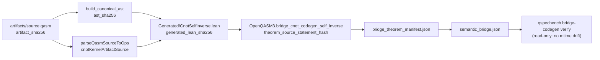
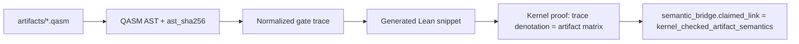

# OpenQASM-to-Lean bridge codegen design

Full **kernel_checked_artifact_semantics** requires Lean proofs that the OpenQASM artifact
denotes the same operator as the formal gate semantics — not merely a manifest-listed theorem
on a fixed gate trace.

## Current state (2026-06-29, v0.2.3)

- **manifest_checked_theorem_binding**: allowlisted gate trace + Lean theorem name + SHA256 hashes
- **python_denotation_consistency**: Python matrix extractor matches Lean `denotateOps*` on trace
- **kernel_checked_codegen_trace**: legacy label; six bridges promoted to **`kernel_checked_artifact_semantics`**
- **kernel_checked_artifact_semantics**: Lean `parseQasmSourceToOps` on embedded `*KernelArtifactSource`
  equals codegen ops; six bridges with `ast_authority: lean_mirror` and `lean_ast_sha256` as sole AST authority in verify
- **Codegen pilot**: canonical AST + hash pipeline wired for 6 kernel QASM benchmarks
- **Lean parser (Phase 1A+)**: `parseQasmSource`, `parseQasmSourceToOps`, file-shaped
  `*KernelArtifactSource` for all six kernel artifacts; `canonicalAstToGateList` mirrors Python JSON
- **Dual-manifest (compiler)**: `clifford_simplification_preserves_unitary` records target-side
  AST/codegen hashes alongside source (`target_*` fields in manifest + semantic_bridge)
- **RX(π/2)**: `QasmOp.rx` + `ComplexGate.rxGate`; `bridge_rx_pi2_denotation` manifest-bound.
  Lean lemma `rx_pi2_entry01_ne_hadamard_entry01` documents that global-phase equivalence to H
  is **not** claimed under the complex model.

## Artifact byte policy (LF)

Kernel QASM artifacts use **LF line endings** (`\n`). CI tests hash raw disk bytes via
`sha256(read_bytes(path))` and compare to `semantic_bridge.artifact_sha256` and Lean
`*KernelArtifactSource` UTF-8 bytes. Repository `.gitattributes` should keep `*.qasm text eol=lf`
so Windows checkouts do not drift hashes.

Regenerate embedded Lean sources from disk with:

```bash
python scripts/sync_kernel_artifact_sources.py
python scripts/sync_kernel_artifact_sources.py --include-target  # Toffoli target artifact
```

The sync script LF-normalizes (`\r\n` → `\n`) before embedding. Never hand-edit
`*KernelArtifactSource` literals without re-running sync; `tests/test_phase5.py::test_kernel_artifact_byte_sha256_chain` fails closed on drift.

## Lean-mirror AST hash (`lean_ast_sha256`)

Python `build_canonical_ast` derives the gate list from `extract_matrix`. Lean
`parseQasmSource` / `canonicalAstToGateList` on the same bytes must yield the same JSON gate
objects. For kernel bridges, **`ast_authority: lean_mirror`** marks Lean-mirror parse as the sole
AST authority in `bridge-codegen verify`; Python `ast_sha256` remains a secondary cross-check.

| Field | Authority | Drift control |
|-------|-----------|---------------|
| `ast_sha256` | Python `build_canonical_ast` | secondary cross-check when `ast_authority: lean_mirror` |
| `lean_ast_sha256` | Lean-mirror JSON from `parseQasmSource` gate list | **primary** for kernel bridges |
| `ast_authority` | `lean_mirror` on all six kernel bridges | required in manifest + semantic_bridge |

CI: `test_kernel_lean_ast_sha256_matches_python_ast` plus manifest/bridge validators.

## CNOT gold-standard chain (kernel_checked_codegen_trace)

End-to-end verification for `cnot_self_inverse_cancellation` (see `tests/test_cnot_end_to_end.py`,
`tests/test_phase5.py::test_cnot_kernel_artifact_source_matches_disk_and_manifest`):



Read-only rule: `bridge-codegen verify` and `render_for_benchmark` must not write
`lean/QSpecBench/Generated/*.lean` or evidence witness copies; only `generate` mutates files.

## Python → AST trust boundary (closed for kernel bridges)

The codegen pipeline builds the canonical AST from **Python** `extract_matrix` gate
traces for non-kernel paths. Kernel-checked bridges set **`ast_authority: lean_mirror`**:
`bridge-codegen verify` pins `lean_ast_sha256` from Lean-mirror parse; Python `ast_sha256`
is a secondary cross-check (warn-only drift when elaborator cache present).

| Stage | Trust level | Drift control |
|-------|-------------|---------------|
| QASM bytes | `artifact_sha256` in manifest + provenance | CI byte-hash test ↔ Lean source |
| Python parse → gate trace | Same extractor as verify-bridge | `gate_trace_sha256` |
| Lean parse → gate list | `parseQasmSourceToOps *KernelArtifactSource` | `artifact_parse_theorem` + **`lean_ast_sha256`** |
| Canonical AST JSON | Lean-mirror for kernel bridges | `ast_authority: lean_mirror` |
| Python AST JSON | Secondary cross-check | `ast_sha256` (must match lean mirror in CI) |
| Lean codegen stub | Emitted from AST | `generated_lean_sha256` |
| Kernel proof | On `QasmOp` list in `OpenQASM3.lean` | `theorem_sha256` + lake build |

## Lean-side parser (QSpecBench.Quantum.OpenQASM3Parser)

Module in lake graph:

1. `structure CanonicalAst` mirroring JSON AST metadata
2. `canonicalAstToGateList` — gate `{op, qubits}` list matching Python `build_canonical_ast`
3. `def parseQasmSource : String → Option CanonicalAst` — gate lines from raw QASM
4. `def parseQasmSourceToOps : String → Option (List QasmOp)` — full file grammar per benchmark
5. Theorem per bridge: `parseQasmSourceToOps *KernelArtifactSource = some Generated.*.ops`
6. End-to-end: `bridge_cnot_artifact_parse_eq_codegen` (parse + self-inverse)
7. Python cross-test in `tests/test_phase5.py` on all six kernel-checked QASM artifacts

### Theorem hash honesty

| Field | Authority | Notes |
|-------|-----------|-------|
| `theorem_elaborator_hash` | **Lean elaborator export** (`ExportTheoremTypesCheck.lean` via `lake env lean`; `scripts/export_theorem_types.py`) | **Primary at v0.3**; cached in `.cache/theorem_elaborator_types.json` |
| `theorem_source_statement_hash` | Syntactic Lean source extraction (regex) | Secondary cross-check; warning-only when elaborator cache present |
| `theorem_identifier_sha256` | Stable JSON of module + theorem name | Identifier pin, not statement content |

`theorem_source_statement_hash` is **not** an elaborator or kernel export. Do not describe it
as proving statement equivalence under α-conversion or implicit args.

Legacy manifest field `theorem_content_sha256` is a deprecated alias with identical bytes.

## Target architecture



## v0.3 theorem hashing ADR (Phase 3 — adopted)

**Decision:** `theorem_elaborator_hash` is computed from the normalized type of each kernel bridge
theorem, exported by **`ExportTheoremTypesCheck.lean`** (`lake env lean` after `lake build`) and
`scripts/export_theorem_types.py`. Pins live in `BridgeMetadata.lean` and semantic_bridge manifests.

**Rationale:** Syntactic regex extraction drifts on whitespace and binder formatting; Lean `#check`
type export is stable under proof-body edits and aligns with maintainer intent for "what is claimed."
`lake exe exportTheoremTypes` remains documented as an alternate path when the check-file export fails.

**Migration:** Schema **0.3** makes elaborator hash the primary authority when the export cache is
present. Regex `theorem_source_statement_hash` is retained as secondary cross-check (validate warns,
does not fail, when elaborator cache covers the benchmark).

**CI:** After `lake build`, run `python scripts/export_theorem_types.py` before
`qspecbench bridge-metadata verify` (see `.github/workflows/validate.yml`).

## Planned steps

1. **AST canonicalization** — stable JSON AST, `ast_sha256` in manifest (done for 6 kernel bridges)
2. **Codegen** — emit Lean `def ops` from trace (done for kernel subset)
3. **Proof templates** — `denotateOpsN` proofs (done for 6 bridges)
4. **Hash pipeline** — CI drift via `bridge-codegen verify` + `bridge-metadata verify`
5. **Artifact parse theorems** — `parseQasmSourceToOps` = codegen ops (Phase 1–2)
6. **Label upgrade** — `kernel_checked_artifact_semantics` when parse + codegen + proof chain complete
7. **Elaborator hash** — v0.3 schema field + export tooling (Phase 3)

## full_dynamic_semantics (P3 design)

`qasm_extraction.mode=full_dynamic_semantics` is accepted when `semantics_base=dynamic_circuit`
and `allowed_to_skip` includes `measurement`. Extraction records `projective_povm_stub` metadata;
skipped lines are not kernel-checked.

Until then, default `unitary_fragment` and validators reject `full_dynamic_semantics` with
a message directing callers to the unitary mode.

## Out of scope for first kernel bridge

- Dynamic circuits (measurement, classical control)
- Full OpenQASM3 language
- Hardware calibration semantics

## RX(θ) blocker (rx_gate_equivalence_small_instance)

`bridge_rx_pi2_denotation` shows complex denotation; global-phase equivalence to H is not claimed.
Benchmark stays `reference_scaffold` with `python_denotation_consistency` only.

## CI implications

- Run `qspecbench bridge-codegen verify` on entries with non-null codegen hashes
- Run `qspecbench bridge-metadata verify` after `lake build`
- Keeps separate from manifest binding job to avoid conflating trust levels

See [roadmap.md](roadmap.md) P1/P2 milestones.
