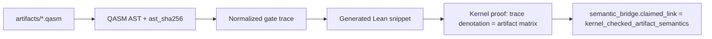

# OpenQASM-to-Lean bridge codegen design

Full **kernel_checked_artifact_semantics** (`kernel_checked_artifact_semantics`) requires Lean proofs
that the OpenQASM artifact denotes the same operator as the formal gate semantics — not merely a
manifest-listed theorem on a fixed gate trace.

## Current state (2026-06-28, Phase 8)

- **manifest_checked_theorem_binding**: allowlisted gate trace + Lean theorem name + SHA256 hashes
- **python_denotation_consistency**: Python matrix extractor matches Lean `denotateOps*` on trace
- **kernel_checked_artifact_semantics**: five bridges — `cnot_self_inverse_cancellation`,
  `hadamard_conjugates_x_to_z`, `single_qubit_gate_cancellation`, `bell_state_preparation`,
  `swap_from_three_cx` — each with AST + `generated_lean_sha256`, `theorem_sha256`, and kernel proof
  on the codegen `QasmOp` trace
- **Codegen pilot**: canonical AST + hash pipeline wired for 5+ benchmarks (CNOT, H-X-H, H-H, Clifford H-H-S, RX, SWAP)
- **Lean parser stub (Phase 8)**: `parseLines` via computable `parseLineQasmOp`; `parseLines_bell_eq_bell_prep_ops`
  and `parseLines_swap_eq_swap_codegen_ops`; Python cross-test covers all five kernel-checked QASM artifacts
- **Dual-manifest (compiler)**: `clifford_simplification_preserves_unitary` records target-side
  AST/codegen hashes alongside source (`target_*` fields in manifest + semantic_bridge)
- **RX(π/2)**: `QasmOp.rx` + `ComplexGate.rxGate`; `bridge_rx_pi2_denotation` manifest-bound.
  Lean lemma `rx_pi2_entry01_ne_hadamard_entry01` documents that global-phase equivalence to H
  is **not** claimed under the complex model.

## Python → AST trust boundary

The codegen pipeline currently builds the canonical AST from **Python** `extract_matrix` gate
traces, not from an independent Lean parser:

| Stage | Trust level | Drift control |
|-------|-------------|---------------|
| QASM bytes | `artifact_sha256` in manifest + provenance | CI provenance check |
| Python parse → gate trace | Same extractor as verify-bridge | `gate_trace_sha256` |
| Canonical AST JSON | Derived from Python trace | `ast_sha256` in manifest |
| Lean codegen stub | Emitted from AST | `generated_lean_sha256` |
| Kernel proof | On `QasmOp` list in `OpenQASM3.lean` | `theorem_sha256` + lake build |

**Honest gap:** byte-level QASM is not parsed inside Lean. A future `OpenQASM3.parseQasm`
kernel would close the Python→AST boundary; until then, kernel-checked bridges prove
denotation of the **codegen trace** that is hash-linked to the Python-derived AST, not
directly to raw QASM syntax.

## Lean-side parser stub (design)

Module `QSpecBench.Quantum.OpenQASM3Parser` (in lake graph):

1. `structure CanonicalAst` mirroring JSON AST metadata (`gateCount`, `nQubits`)
2. `def parseGateLine : String → Option ParsedGate` for `h`, `x`, `cx`/`cnot`, and `rx(...)` lines
3. Theorems `parseGateLine_bell_h_toQasmOp`, `parseGateLine_bell_cx_toQasmOp` (parse → `toQasmOp` soundness)
4. Python cross-test in `tests/test_phase5.py`: gate lines from all four kernel-checked artifacts vs `build_canonical_ast`

**Remaining gap:** bytes→AST is still Python-side (`build_canonical_ast` / `extract_matrix`). The Lean
parser validates line-level alignment only; it does not close `kernel_checked_artifact_semantics` alone.

## Target architecture

## Planned steps

1. **AST canonicalization** — stable JSON AST, `ast_sha256` in `bridge_theorem_manifest.json` (pilot done for CNOT)
2. **Codegen** — emit Lean `def <benchmark>_ops` from trace (parameterized gates: RX(θ), RZ(θ), U)
3. **Proof templates** — `denotateOpsN <benchmark>_ops = <matrix>` by `fin_cases` or tactic macro
4. **Hash pipeline** — `generated_lean_sha256`, CI drift check via `qspecbench bridge-codegen verify`
5. **Obligation wiring** — `obligation_ids` in manifest maps theorems to `claim_scope` entries
6. **First candidate** — `cnot_self_inverse_cancellation` retrofitted as codegen golden test (hashes wired; kernel proof gap documented)
7. **Second candidate** — parameterized RX(π/2) using `ComplexGate.rxGate` (Lean denotation done; manifest blocked on global phase)

## Gap to kernel_checked_artifact_semantics (remaining for other benchmarks)

The CNOT pilot closes the chain: codegen ops live in `OpenQASM3.lean`, kernel theorems
`bridge_cnot_codegen_self_inverse` and `bridge_cnot_codegen_denotes_artifact` tie denotation to
the artifact matrix model, and manifest records `theorem_sha256`.

### Precise remaining obligations (non-CNOT benchmarks)

| Layer | CNOT pilot | Other manifest bridges |
|-------|------------|------------------------|
| Artifact bytes | `artifact_sha256` in manifest + provenance | Same |
| Parse / AST | `ast_sha256` drift in CI | Partial (codegen hashes on subset) |
| Codegen stub | `generated_lean_sha256` + lake-imported ops | Evidence-only stubs for some |
| Matrix proof | `bridge_cnot_codegen_*` on codegen trace | Hand-named op lists |
| Kernel link | `kernel_checked_artifact_semantics` | Still `manifest_checked_theorem_binding` |

## full_dynamic_semantics (P3 design)

`qasm_extraction.mode=full_dynamic_semantics` is accepted when `semantics_base=dynamic_circuit`
and `allowed_to_skip` includes `measurement`. Extraction records `projective_povm_stub` metadata;
skipped lines are not kernel-checked.

### Measurement semantics

- Projective measurement on declared basis with classical outcome register wiring
- Optional POVM branch with explicit declaration in `qasm_extraction`
- Lean: `QasmOp.measure` + state update lemmas compatible with `denotateOps` fragment

### Classical control

- Parse `if (c) x q[i];` and feed-forward from prior measurements
- Classical register indexing in canonical AST (`classical_deps` field)
- Codegen emits control predicates; proof obligations per supported control pattern

### Reset and initialization

- `reset q[i];` and `initialize` as non-unitary prep in extraction pipeline
- Distinct trust level: cannot reuse unitary-only `manifest_checked_theorem_binding`

### Benchmark coverage target

At least one `reference_scaffold` with checked unitary fragment plus documented dynamic gap
(teleportation benchmark is the natural candidate once measurement is modeled).

Until then, default `unitary_fragment` and validators reject `full_dynamic_semantics` with
a message directing callers to the unitary mode.

## Out of scope for first kernel bridge

- Dynamic circuits (measurement, classical control)
- Full OpenQASM3 language
- Hardware calibration semantics

## RX(θ) blocker (rx_gate_equivalence_small_instance)

`bridge_rx_pi2_denotation` shows `denotateOps1C rx_pi2_ops = rxGate (π/2)` entry-wise.
Int scaffold `bridge_rx_pi2_int_eq_h` maps π/2 to unnormalized H. Promoting to
`manifest_checked_theorem_binding` still requires:

1. Manifest entry with real RX gate trace + evidence anchor (not H-plumbing)
2. Closing `global_phase_between_rx_and_h` if headline claims phase equivalence

Until then, the benchmark stays `reference_scaffold` with `python_denotation_consistency` only.

## CI implications

- Run `qspecbench bridge-codegen verify` on entries with non-null codegen hashes
- Keeps separate from manifest binding job to avoid conflating trust levels

See [roadmap.md](roadmap.md) P1/P2 milestones.
